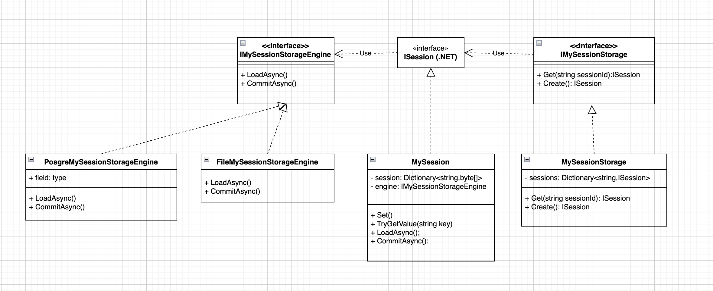
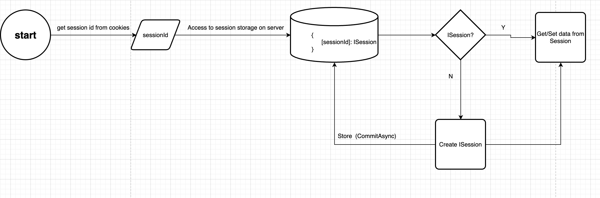

# MySession cloned
This repository cloned how the Session works in .Net Core. By cloning the way of working of Session I gained the knowledge about it clearly, deeply. It also helps me to know more about implement integrate test in ASP.NET
MVC 
This is my understanding about Session and the way i implement. Currently, i just store the sessions in file. We can scale this by implement store it in other database like MongoDb, PostgreSQL,...
## MySession Implement

## Session workflow

